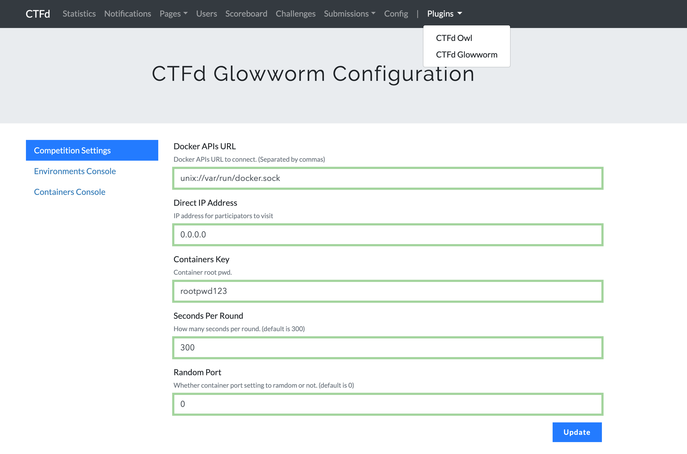
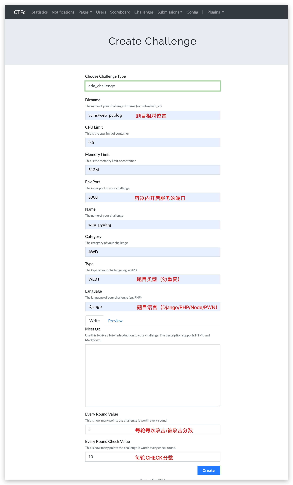
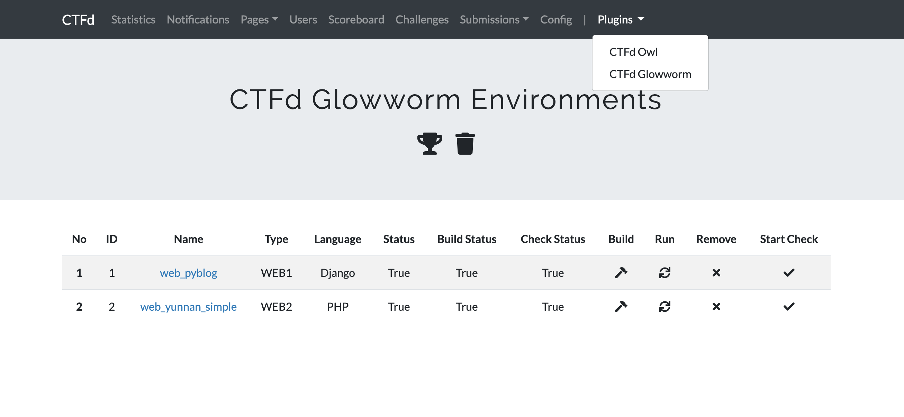
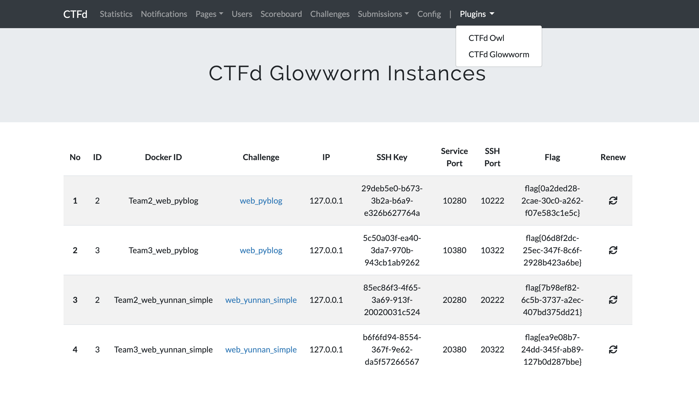
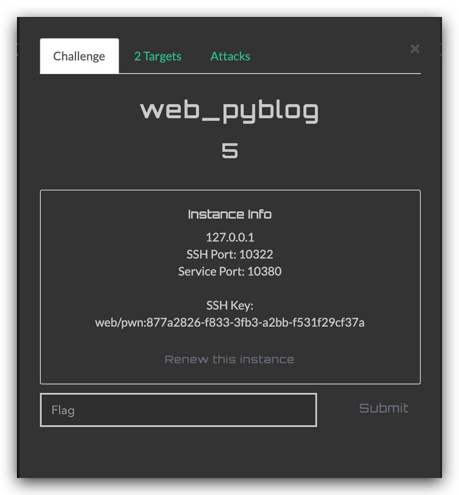
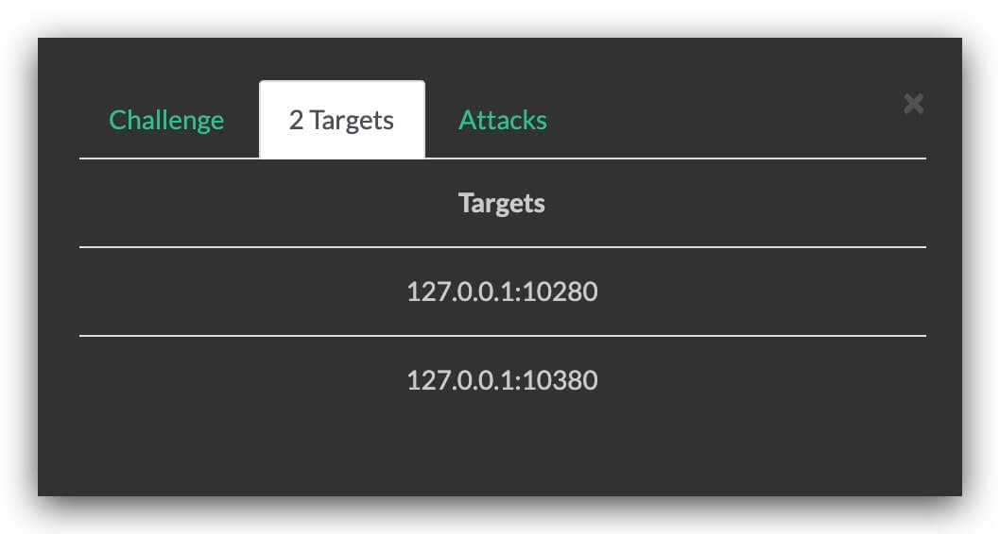
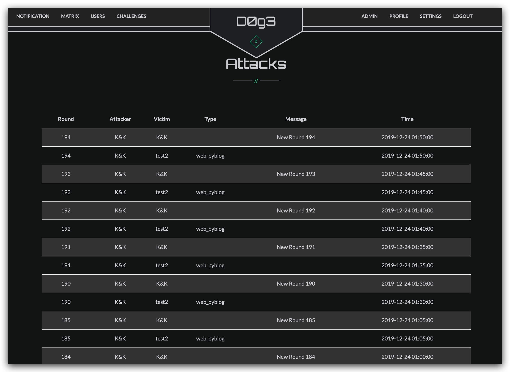

# CTFd-Glowworm

**Attack With Defence Challenge for CTFd**

## Installation

**REQUIRES: CTFd >= v2.x**

1. Clone this repository to `CTFd/plugins`. It is important that the folder is
named `ctfd_glowworm`.

## How to Use

### Configuration

**Docker APIs URL** API名字（默认为`unix://var/run/docker.sock`）

**Direct IP Address** 服务器IP

**Containers Key** 容器root密码

**Seconds Per Round** 每轮时间

**Random Port** 是否开启随机端口（默认填0）

### Add Challenge

**Challenge Type** 题目类型(选`ada_challenge`)

**Dirname** 题目所在文件夹（相对路径）

**Docker image name** Build的image name(若有开源的题目，可直接写docker-hub上的名字)

**Env Port** 容器内开放端口

**Type** 题目类型（WEB1，WEB2，PWN1，PWN2）

**Language** 题目语言（PHP，Django，Node，PWN）

**Every Round Value** 每轮每次攻击/被攻击分数

**Every Round Check Value** 每轮CHECK分数

### Start / Remove a competition

添加完题目后。请预先设置好**比赛开始时间**、**比赛结束时间（可选，若不设置则永不结束）**

然后点击`奖杯`即初始化比赛，然后依次`Build` ->`Run` -> `Check`所需题目环境即可

### Demo

