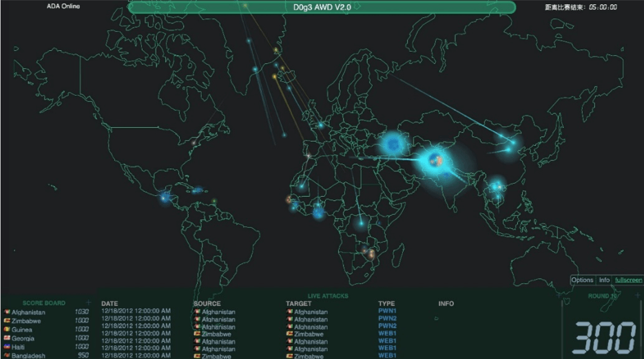
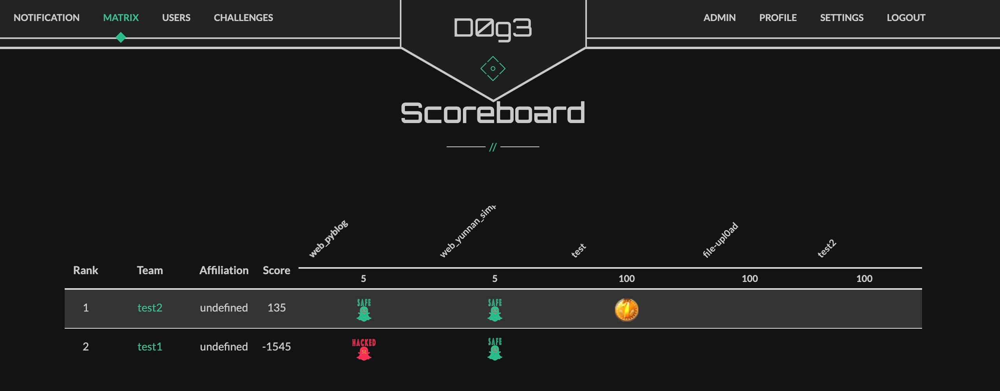
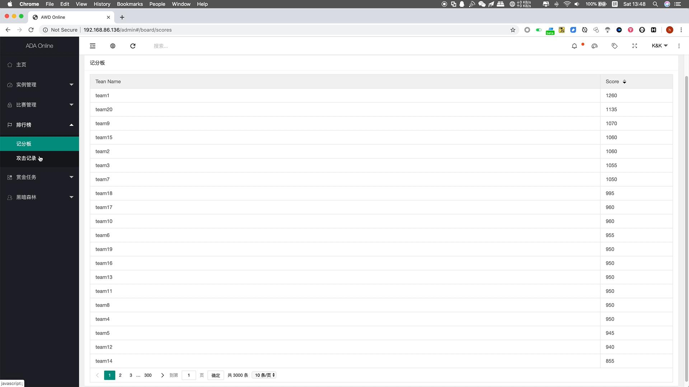
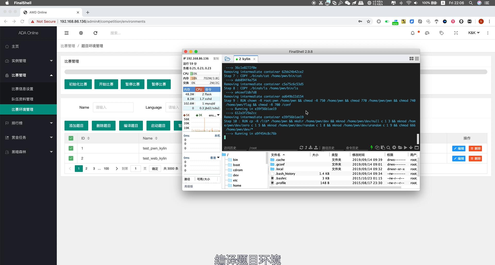

## What is H1ve
An **Easy** / **Quick** / **Cheap** Integrated Platform

H1ve是一款自研CTF平台，同时具备解题、攻防对抗模式。其中，解题赛部分对Web和Pwn题型，支持独立题目容器及动态Flag防作弊。攻防对抗赛部分支持AWD一键部署，并配备炫酷地可视化战况界面。



## How to use

```bash
git clone https://github.com/D0g3-Lab/H1ve.git
cd H1ve
```

### Single Mode (Recommended)

```bash
docker-compose -f single.yml up
```

### Single-Nginx Mode

```bash
docker-compose -f single-nginx.yml up
```

Know more on the [wiki](https://github.com/D0g3-Lab/H1ve/wiki)

### Plugins Settings

[CTFd-Owl](https://github.com/D0g3-Lab/H1ve/tree/master/CTFd/plugins/ctfd-owl)

[CTFd-Glowworm](https://github.com/D0g3-Lab/H1ve/tree/master/CTFd/plugins/ctfd_glowworm)


## Architecture


## Open Source Schedule

* :white_check_mark: [解题赛CTFd版](https://github.com/D0g3-Lab/H1ve/tree/master/CTFd/plugins/ctfd-owl)  
* :white_check_mark: [攻防对抗赛CTFd版](https://github.com/D0g3-Lab/H1ve/tree/master/CTFd/plugins/ctfd_glowworm)
*  UI改版（前后端分离）
*  大屏实时战况页面（待定）
*  一体化自研版（待定）
*  银河麒麟版（待定）

一体化自研版基于Flask、Docker、d3.JS、layui编写，已应用到数次AWD训练赛中，但由于前端框架layui为付费开发框架，不宜开源，目前仅在内部使用。

## Live Demo

### 解题赛CTFd版
https://ctf.d0g3.cn

https://ctf.dao.ge (备用)

**平台首页**


**CTF Challenge**


基于CTFd进行二次开发，在保留CTFd稳定性的情况下，提供优化版前端界面，队伍隔离容器，动态Flag机制。

### 攻防对抗赛CTFd版

**AWD Challenge** 




### 一体化自研版

**初始化比赛信息** 


**排行榜** 



### 银河麒麟版

**编译界面** 



## Project Vision
该平台设计的初衷，是为网安人才培养领域提供一个低成本、高成效的教学平台。希望通过线上解题、线下ADA赛制自动化部署流程，降低比赛举办难度。

希望能为新晋CTF战队提供简单易用的训练平台，并希望通过AWD，将攻防对抗体验引进大学、中学课堂，引导网安科班生建立兴趣，降低攻防技术的学习成本，进而逐步精进自身的网络安全实战技术。 

### Bugs Bounty Plan
若在使用过程中发现了平台Bug，欢迎提交Issue，我们会尽快修复。
贡献者ID将被加入平台的贡献者荣誉列表。
并有机会获得D0g3年度纪念礼品(定制T恤、感谢Logo银贴等)

### Suggestions Bounty Plan
如果有哪些有助于“项目愿景”实现的意见和建议，欢迎提交Issue，或在“道格安全”官方微信公众号中留言。
重大可行建议贡献者的ID将被加入平台贡献者荣誉列表。

## Copyright Affirm
本项目遵循[Apache License 2.0](https://github.com/D0g3-Lab/H1ve/blob/master/LICENSE)开源许可

各大高校、安全团队、技术爱好者可随意使用该平台作为训练平台或举办内部训练赛，欢迎使用该平台进行公益性技术分享。

但不允许在未经许可的情况下，使用该平台代码开展商业培训、商业比赛、产品销售。尤其禁止恶意更换平台Logo及界面，开展任何营利性行为。

一经发现，使用者ID、相关商业机构名称将被挂在Github项目“抄袭者列表”。
同时D0g3，保留追究其法律责任的权力。