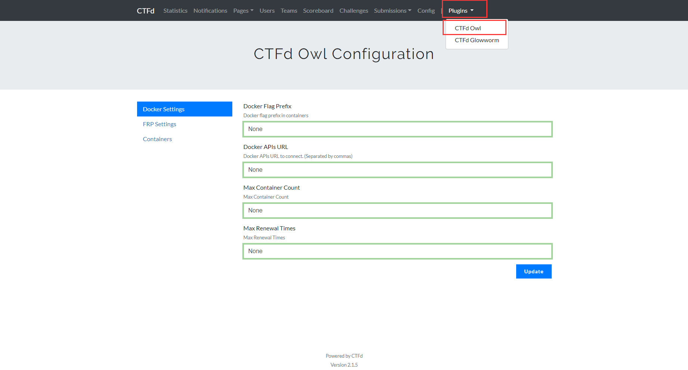
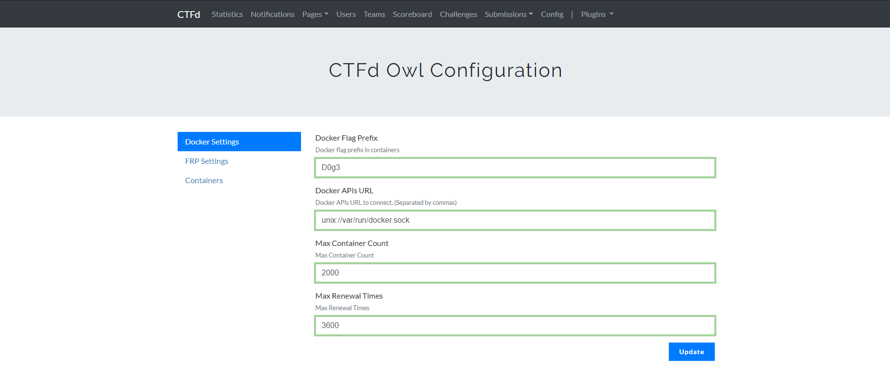
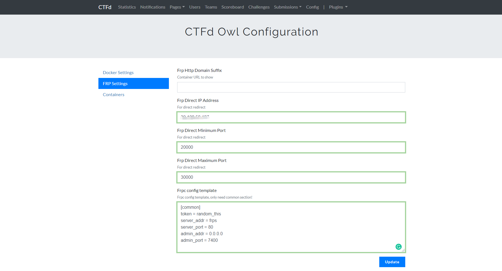
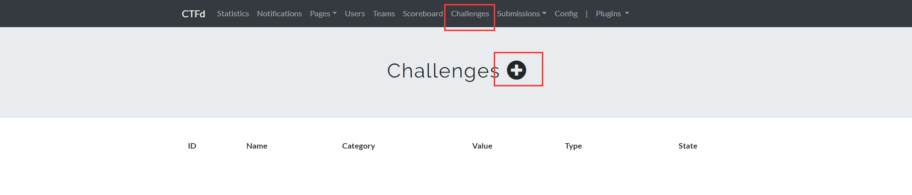
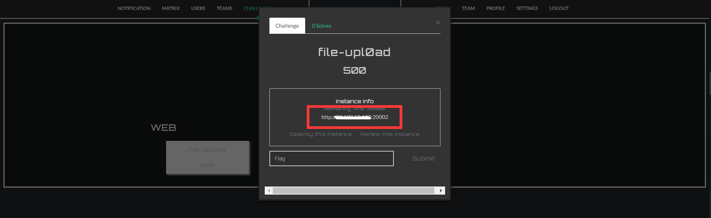
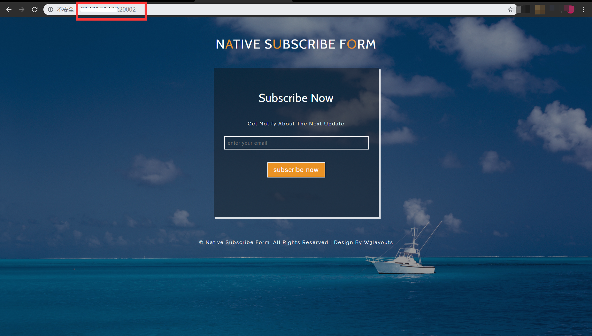

# CTFd-Owl

## 插件设置

登录管理员账号之后点击上方的Admin即可进入管理页面


点击plugins->CTFd Owl进入Owl插件设置界面



Docker Setting各项设置分别是：

- Docker Flag Prefix Flag前缀
- Docker APIs URL API名字（默认为unix://var/run/docker.sock）
- Max Container Count 最大容器数量（默认无限制）
- Max Renewal Time 最大容器延长时间（超过将无法延长，达到时间后会自动摧毁）

FRP Settings各项设置分别是：

- FRP Http Domain Suffix FRP域名前缀（如开启动态域名转发必填）
- FRP Direct Ip Address FRP frp服务器IP
- FRP Direct Minimum Port 最小端口
- FRP Direct Maximum Port 最大端口
- FRP Config Template Frpc热重载配置头模版(如不会自定义，尽量按照默认配置)

```
[common]
token = random_this
server_addr = frps
server_port = 80
admin_addr = 0.0.0.0
admin_port = 7400
```

简单例子设置如下：



(由于例子环境中没有绑定域名，所以Frp Http Domain Suffix就为空，Frp Direct IP Address
就直接用ip地址代替即可)



## 题目设置

插件设置完成后，点击上方的Challenges，再点击下方的加号即可进入创建题目环境的设置页面



题目环境各项设置分别是：

- Challenge Type 题目类型(选dynamic_check_docker)
- Deployment Type 部署方式(选SINGLE-DOCKER-COMPOSE)
- Dirname 题目所在文件夹（相对于source的相对路径）
- FRP Type frp类型(DIRECT为ip直接访问，HTTP为域名访问)
- FRP Port 题目内网端口(例子中为80)
- Name 题目名称
- Category 题目类别(WEB/MISC/RE/PWN/...)
- Write&Preview 题目介绍
- Initial Value 题目最初分值
- Decay Limit 题目分数达到最小值之前的解决数量
- Minimum Value 题目最小分值

简单例子设置如下：


## 启动题目

点击Create即可创建成功

普通用户登录之后点击CHANLLENGES，下面就会有创建好的题目


点击Launch就可以创建一个新的题目环境了


创建成功之后会生成一个链接：



访问即可看到题目：



## 自定义题目

在`H1ve/CTFd/plugins/ctfd-owl/source/test/`目录下有一个题目例子(file-upl0ad)

编写Dockerfile参考例子即可


