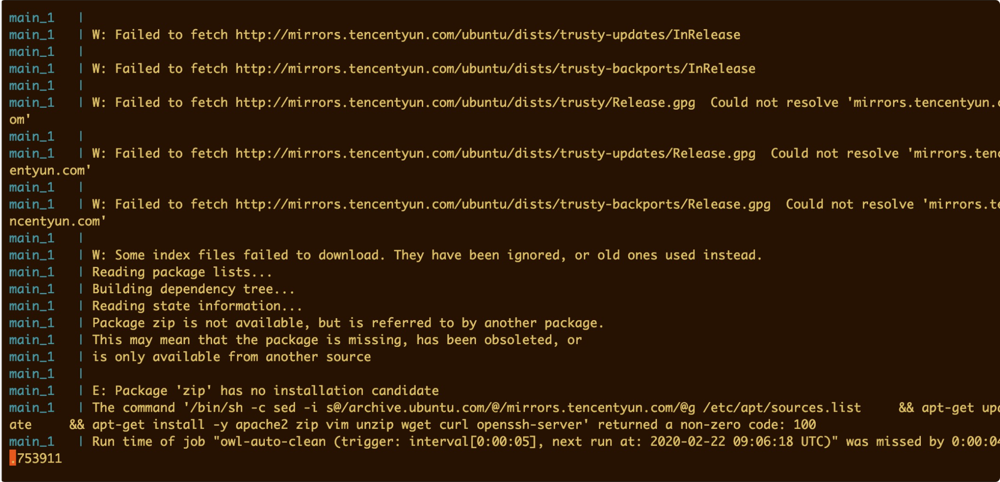

# 常见问题

## 1. 安装过程中网络问题而导致的错误

常见报错格式：

	pip._vendor.urllib3.exceptions.ReadTimeoutError: HTTPSConnectionPool(host='files.pythonhosted.org', port=443): Read timed out.
	ERROR: Service 'main' failed to build: The command '/bin/sh -c pip install -r requirements.txt' returned a non-zero code: 2

**解决办法：**

- 方法一：

使用代理，linux系统可以参考：

[Linux 命令行下使用 Shadowsocks 代理](https://mritd.me/2016/07/22/Linux-%E5%91%BD%E4%BB%A4%E8%A1%8C%E4%B8%8B%E4%BD%BF%E7%94%A8-Shadowsocks-%E4%BB%A3%E7%90%86/)

- 方法二：

再重新`docker-compose -f single.yml up`，并期待网络变得持续稳定。

## 2. 运行成功后访问不到

访问：`http://ip:8000/` 即可进入配置页面。


## 3. Networks.frp value 错误

直接运行命令：

```
docker-compose -f single.yml up
```

如果出现下面的错误：


**解决方法**：

更新 docker-compose 到高版本即可。参考上面的安装方法。或者安装官方的：

```
https://github.com/docker/compose/releases
```


## 4. Dockerfile 运行不成功



一般是镜像源的问题，使用国内镜像源应该可以解决，将 docker 镜像源和 apt 的镜像源都换掉：

-  docker 镜像源设置教程：https://blog.csdn.net/whatday/article/details/86770609
- apt 镜像源的设置：

```
FROM ubuntu:14.04
# 改成阿里云镜像源
RUN sed -i s@/archive.ubuntu.com/@/mirrors.aliyun.com/@g /etc/apt/sources.list \
    && apt-get update \
    && apt-get install -y apache2 zip vim unzip wget curl openssh-server
...
```