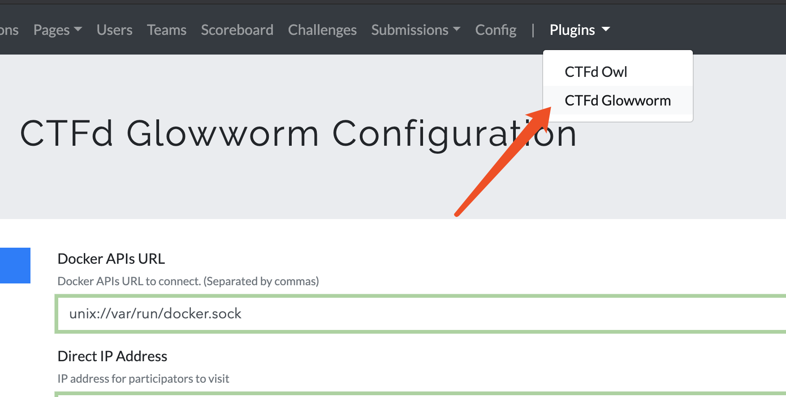
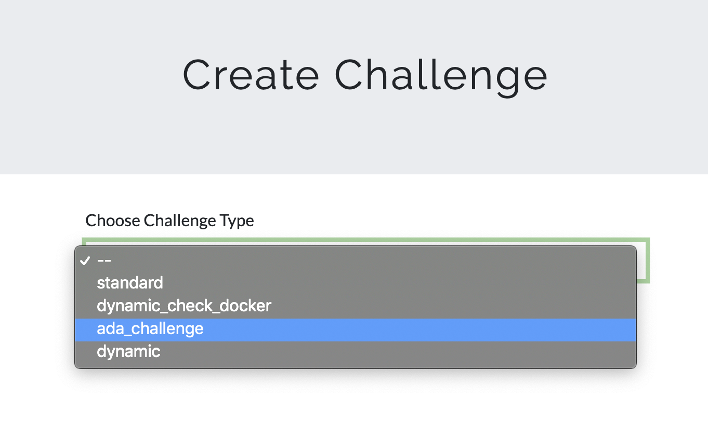
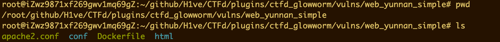
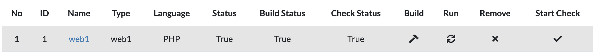
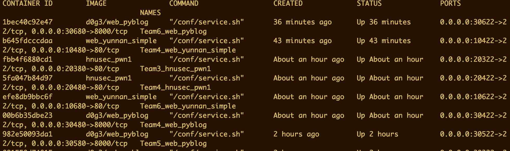

# CTFd-Glowworm

这个是一个 AWD 模式的插件，下面介绍一下使用方法和一些注意的地方，遇到有关问题可以看最后面。

## 插件配置

在 Plugins/CTFd Glowworm 下进入 awd 选项：

在 Competition 中：

- Docker APIs URL 填写 unix://var/run/docker.sock

- Direct IP Address 填写 服务器外网IP
- Containers Key 填写 docker 虚拟机内 root 用户的密码
- Seconds Per Round 一轮攻击的时间间隔。
- Random Port、Random Minimum Port、Random Maximum Port 一般都填 0。 

## 题目设置

在 Admin/Challenges 导航栏下选择添加题目：

添加的题目类型选择 ada_challenge：

- Dirname

填写部署目录，也就是填写本地 vulns/ 目录下的相对路径，例如这里需要使用 web_yunnan_simple 这个环境，就需要填写 vulns/web_yunnan_simple。

- Docker image name

这个填的是 docker 的镜像文件的目录名，如果这里是本地的目录，类似于上面那个 web_yunnan_simple，这里就填写 web_yunnan_simple 即可。

如果是 dockerhub 上的镜像的话，就填镜像的全名即可。

- CPU Limit

这个随意，一般填 0.5。

- Memory Limit

随意，根据队伍数量来定。一般填 1024M。

- Env Port

docker 虚拟机内的 web/pwn 端口，利用 docker 里使用 apache 部署的话，那么默认是 80 端口，这里就填 80。

- Name

题目的名称。可以任意

- Category

题目类型。web/pwn。

- Type

题目类型名。可以任意

- Language

这里比较重要，根据部署题目语言的不同，这里仅支持四种选项：

1. PHP
2. Node
3. Django
4. PWN

前三个是 web 题的选项，后面是 pwn 题的选项，注意只能填大写。这里如果填错的话会导致题目的服务运行不起来。

- Every Round Value

一个 flag 可以得到的分数。

- Every Round Check Value

check 一次扣除几分。

如果是 pwn 题的话，在 Files 导航栏下面还需要上传二进制文件。

## 启动环境

在 Environment console 中，进行每道题目的配置：

1. 首先点击奖杯图标进行初始化
2. 对于每道题目，如果是第一次部署的话，先点击 **Build** 下面的小锤子，进行 docker 镜像的安装。在控制台可以看到安装的进度。
3. 接着点击 Run，题目 （docker 容器）就会运行起来。点击 Start Check 就会开启 check 模式。

- 具体的配置信息，调试信息以控制台的 log 信息为准。

## 检查服务是否正常

`docker ps` 命令查看 docker 题目是否正常运行，端口是否映射正确，题目是否正常，外网是否能够访问到服务。如果有问题看控制台信息，或者`docker exec`进入容器中进行排错。

## 自定义题目