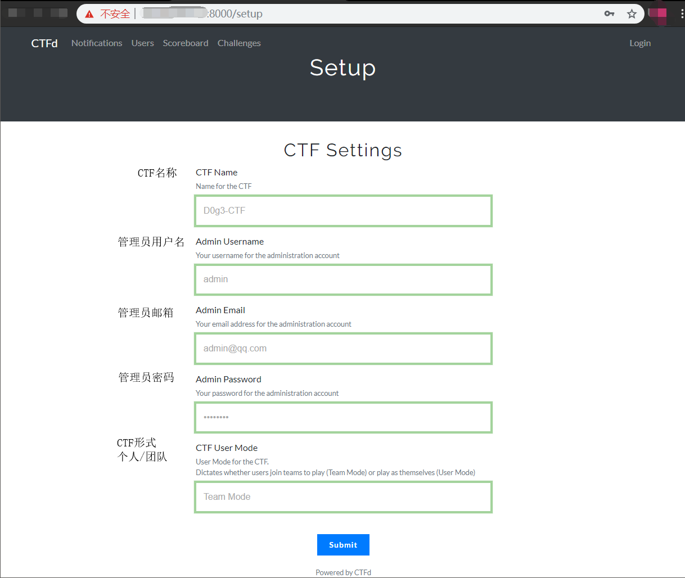
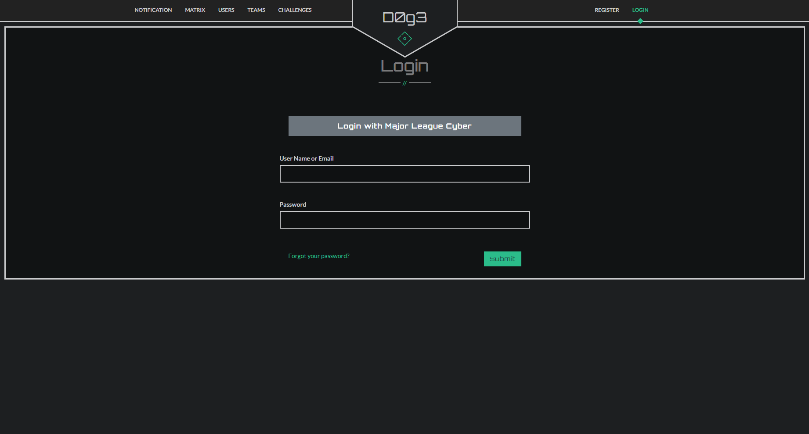

# 安装

- 安装 Docker：

参考：[Ubuntu Docker 安装](https://www.runoob.com/docker/ubuntu-docker-install.html)

	安装最新的docker
	wget -qO- https://get.docker.com/ | sh
	
	安装完会有一个提示，按照提示去执行
	sudo usermod -aG docker ubuntu

命令执行完成之后，执行 `docker verison` 来查看是否安装完成。


- 安装 Docker-compose：

参考：[https://github.com/docker/compose/releases](https://github.com/docker/compose/releases)

	sudo curl -L https://github.com/docker/compose/releases/download/1.25.1/docker-compose-`uname -s`-`uname -m` -o /usr/local/bin/docker-compose
	
	sudo chmod +x /usr/local/bin/docker-compose

同样的，命令执行完成之后，执行 `docker-compose verison` 来查看是否安装完成。


- 换源

```
sudo vim /etc/docker/daemon.json
```

将daemon.json的值改为：

```
{
	"registry-mirrors": ["https://docker.mirrors.ustc.edu.cn","https://mirror.ccs.tencentyun.com"]
}
```

### 安装git

	sudo apt install git

### 拉取仓库

	git clone https://github.com/D0g3-Lab/H1ve.git
	cd H1ve
	docker-compose -f single.yml up

### 常用docker命令

	启动服务：
	docker-compose -f single.yml up -d
	停止服务：
	docker-compose -f single.yml stop


### 首次启动

首先访问会进入到Setup步骤：

各项设置分别是：

- CTF Name CTF名称
- Admin Username 管理员用户名
- Admin Email 管理员邮箱
- Admin Password 管理员密码
- CTF User Mode CTF形式(个人赛/团队赛)



设置完成后点击Submit就可以正常注册登录了

